# 🇮🇳 Multilingual RAG-Powered Virtual Assistant for Government Examination Preparation using Azure OpenAI, LangChain, and Microsoft Fabric Eventhouse

---

## 🧭 Table of Contents
- [Overview](#overview)
- [Features](#features)
- [Prerequisites](#prerequisites)
- [OpenAI Models Used](#openai-models-used)
- [Architecture](#architecture)
- [How It Works](#how-it-works)
- [Setup](#setup)
- [Dashboard](#dashboard)
- [Output](#output)
- [Conclusion](#conclusion)
- [License](#license)
- [Contributing](#contributing)

---

## 🌍 Overview

The **Multilingual RAG-Powered Virtual Assistant** is an AI-driven solution built using **Azure OpenAI**, **LangChain**, and **Microsoft Fabric Eventhouse**.  
It automates the ingestion of **PDF documents** from **official government websites** (via web scraping) and **manual uploads**, assisting students preparing for **government and competitive exams in India**.

This assistant provides **accurate, multilingual, and real-time** information such as notifications, eligibility, and exam schedules — directly from verified PDFs.

### 🎯 Advantages
- Fetches official, verified updates (UPSC, IBPS, SSC, etc.)
- Provides multilingual answers (English, Hindi, and others)
- Extracts both text and tables
- Reduces manual searching across sites
- Uses **Eventhouse** for scalable, vector-based search
- Avoids duplicates using stable `chunk_id`
- Combines **RAG + GPT** for context-based answers

---

## 🚀 Features

| Feature | Description |
|----------|--------------|
| 📄 PDF Ingestion | Extracts both text and tables from multiple PDFs |
| 🌐 Multilingual Support | Answers queries in several Indian languages |
| 🧠 RAG Architecture | Uses embeddings + GPT for contextual answers |
| 💾 Eventhouse Integration | Stores text, embeddings, and metadata |
| 🧾 Deduplication | Stable hash-based chunk identification |
| 📊 Dashboard | KQL-based ingestion and language insights |
| ⚡ Modular Design | Clear, reusable Fabric notebooks |

---

## 🧩 Prerequisites

You need access to:

- ✅ **Microsoft Fabric Account** (Lakehouse + Eventhouse)
- ✅ **Azure OpenAI Studio** (model deployment rights)
- ✅ **Deployed Azure OpenAI Resource** (GPT + embeddings)
- ✅ **Fabric Workspace Setup** (edit + contributor access)
- ✅ **Python Runtime** (Fabric or local conda environment)

---

## 🧠 OpenAI Models Used

| Model | Purpose | Description |
|--------|----------|-------------|
| **`text-embedding-ada-002`** | Embedding | Converts text and tables into dense numerical vectors for similarity-based search |
| **`gpt-4o` / `gpt-35-turbo`** | Language Model | Answers queries contextually using retrieved chunks from Eventhouse |

These models combine to create a **Retrieval-Augmented Generation (RAG)** pipeline that supports multilingual Q&A.

---

## 🏗️ Architecture

This system integrates **Azure OpenAI**, **LangChain**, and **Microsoft Fabric** components for an end-to-end RAG workflow.


### Components
1. **Fabric Lakehouse** → stores PDFs and text extractions  
2. **Fabric Notebooks** → extract, chunk, embed, and upload data  
3. **Azure OpenAI** → generates embeddings and answers  
4. **Eventhouse DB** → stores embeddings and metadata  
5. **KQL Dashboard** → monitors ingestion and data metrics
---

## 💡 How It Works

The RAG pipeline consists of two main phases — **indexing** and **retrieval**.

### 🧱 Step 1: Processing the Files and Indexing the Embeddings

This step prepares and stores vector embeddings into **Fabric Eventhouse**.

1. **Read PDF documents** from Fabric Lakehouse  
2. **Extract both text and tables** using `PyPDFLoader` and `pdfplumber`  
3. **Generate embeddings** using the `text-embedding-ada-002` model  
4. **Store both text and embeddings** into Eventhouse (`embeddingtables`)

📸 *Add diagram:*  


---

### 💬 Step 2: RAG – Getting Answers

1. Convert the question into an embedding  
2. Search that embedding against Eventhouse vectors  
3. Retrieve top-matching chunks  
4. Combine them with the query and pass to **GPT-4o**  
5. GPT returns a fluent, multilingual answer  

📸 *Add diagram:*  
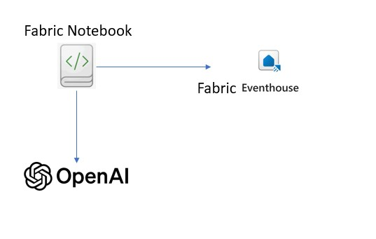

---

## ⚙️ Setup

### 🧩 Step 1 – Create a Fabric Workspace  
Create a workspace named **Myworkspace** and folder **JobaAssistantApp** in Microsoft Fabric.
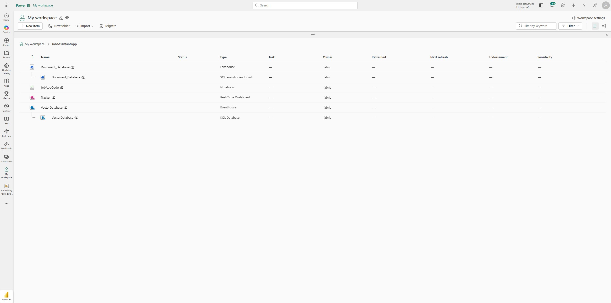

### 🧩 Step 2 – Create a Lakehouse  
Create a Lakehouse named `Document_Database` for storing PDFs and extracted data.
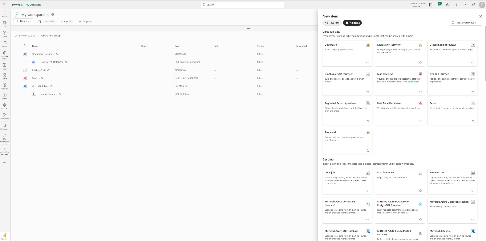

### 🧩 Step 3 – Upload PDFs  
Upload exam PDFs (IBPS, UPSC, DDA, SSC etc.) manually or from a scraping script to:
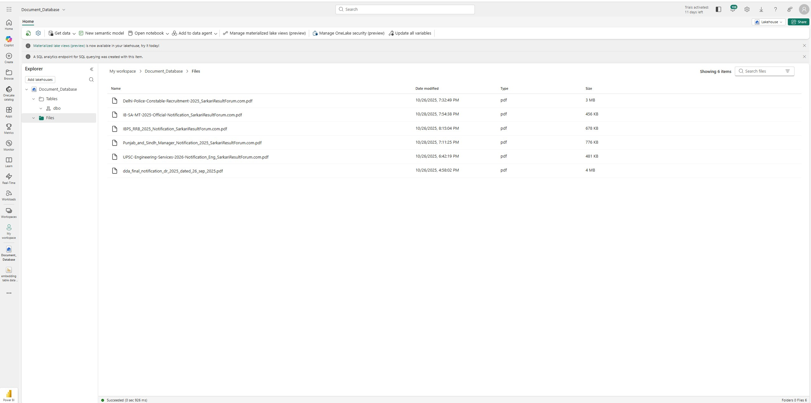

### 🧩 Step 4 – Create an Eventhouse  
Create an **Eventhouse** database named `VectorDatabase`.
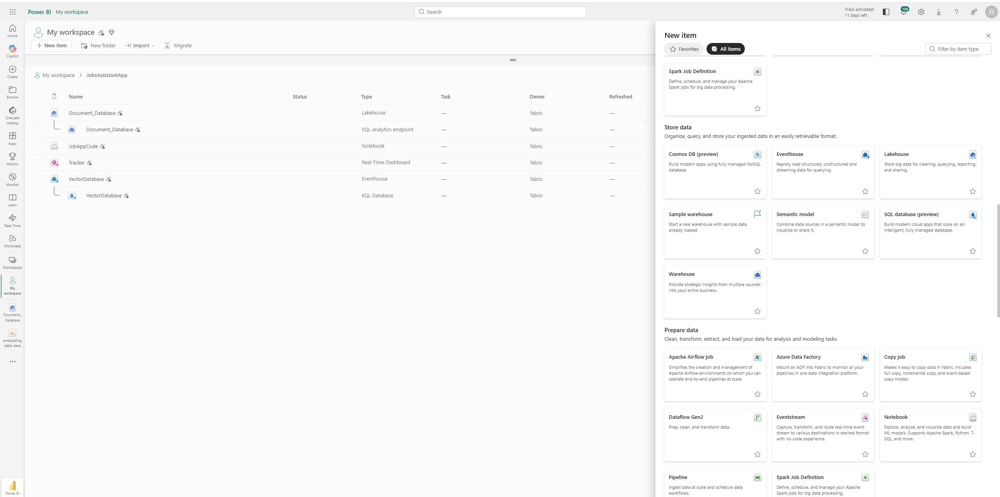
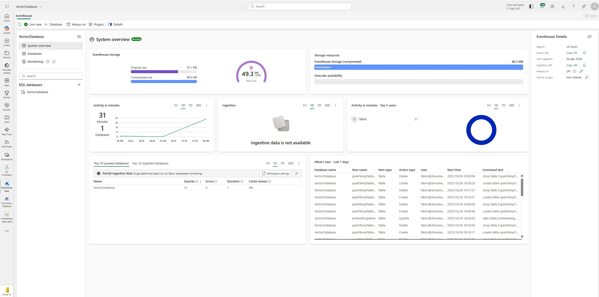

### 🧩 Step 5 – Create the Embeddings Table  
Create a table named `embeddingtables` with columns:  
`doc_id, document_name, source_url, page_no, chunk_no, content, embedding, chunk_id, content_type, lang, ingest_time`
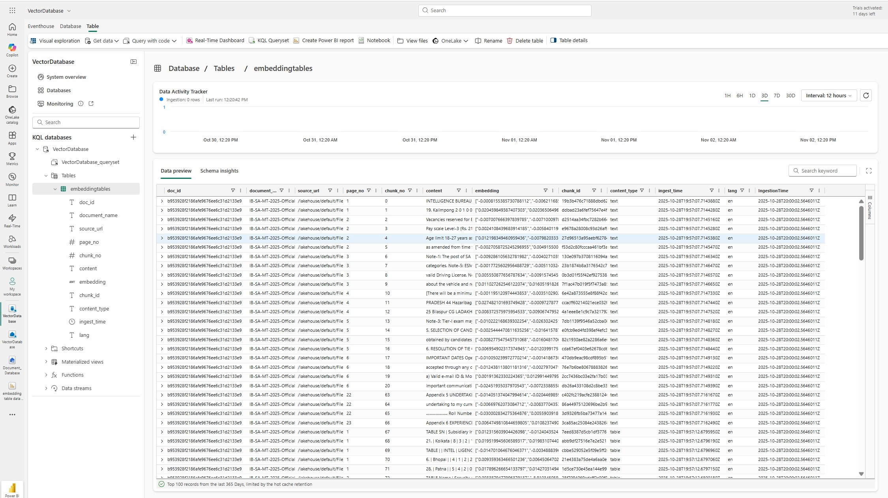

### 🧩 Step 6 – Import and Configure Notebooks  
Upload:
- `AI-Powered Multilingual Job Document Assistant for Recruitment Notifications using Azure OpenAI and Eventhouse.ipynb`
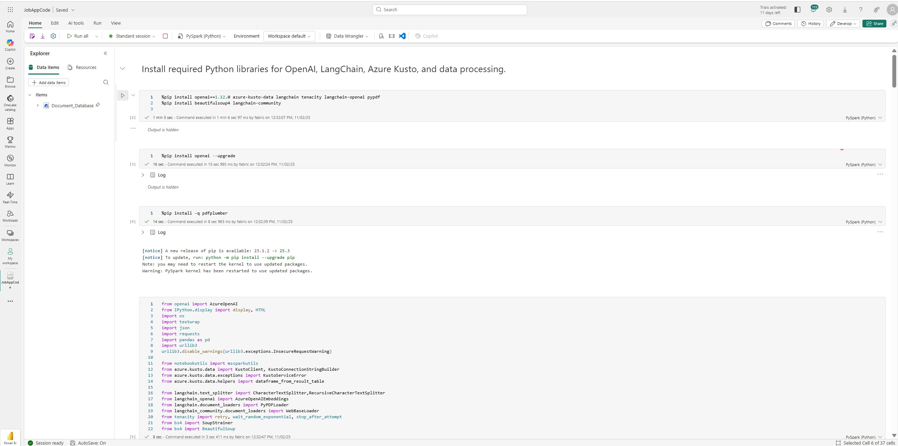

### 🧩 Step 7 – Connect to Eventhouse  
Set the following inside your notebook:

```python
KUSTO_URL = "<your-eventhouse-cluster-url>"
KUSTO_DATABASES = "VectorDatabase"
KUSTO_TABLES = "embeddingtables"
---
---
```
### 🌿 Step 8 – Run the Notebook

Execute all ingestion and embedding cells to process the documents and push them into **Fabric Eventhouse**.

After running the notebook, you should see confirmation logs showing how many chunks (text + tables) were processed.

✅ **Expected log example:**
Loaded 215 text + 54 table chunks = 269 total from IBPS_2025.pdf


This confirms that your pipeline successfully extracted, split, embedded, and stored data for the document.

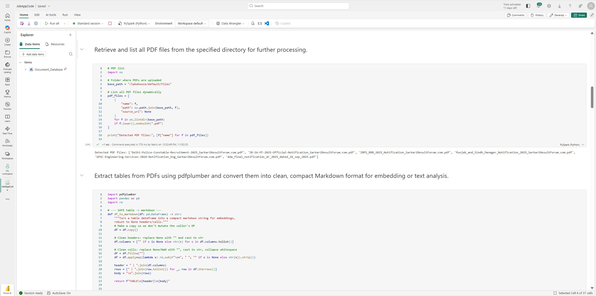
---

### 🧠 Step 9 – Test the RAG Query

Use the **RAG query notebook** to test how the system retrieves and answers questions using stored embeddings.

Run the notebook cells that:
1. Accept a user query.
2. Generate an embedding for that query using the `text-embedding-ada-002` model.
3. Retrieve the most similar chunks from **Eventhouse**.
4. Combine the retrieved content and pass it to **GPT-4o** for natural-language answering.

🧪 **Example Queries**

- “What is IBPS registration date?”  
- “Dy. Director (Architect) ka qualification kya hai?”  

💡 *You should see the assistant respond with precise answers based on the indexed PDFs, proving that your RAG pipeline works end-to-end.*

---
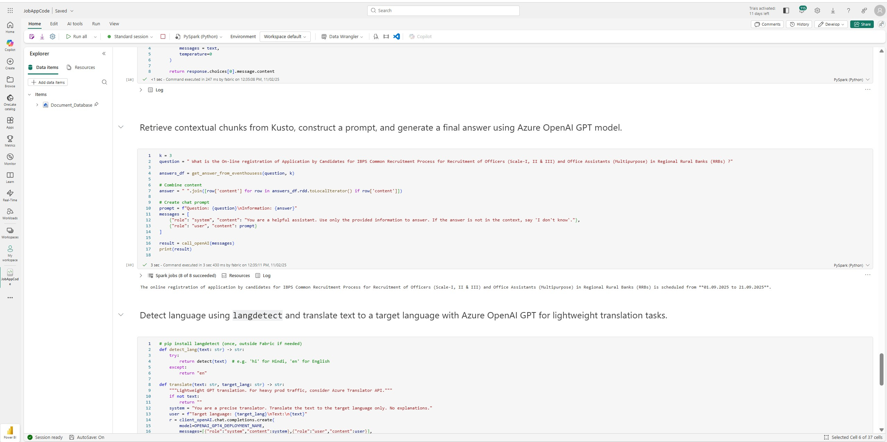
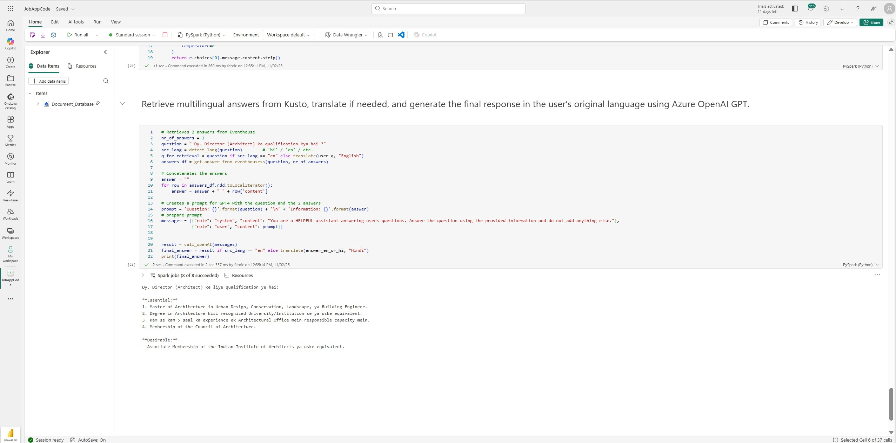
## 📊 Dashboard

Use **KQL Dashboards** in Microsoft Fabric to visualize ingestion and data activity.


### 📈 Recommended Metrics

| Metric | KQL Query | Description |
|---------|------------|-------------|
| **Total Documents** | `count(distinct doc_id)` | Displays the total number of unique PDF documents ingested. |
| **Language Distribution** | `summarize count() by lang` | Shows how many chunks exist per detected language. |
| **Content Type Split** | `summarize count() by content_type` | Compares text vs table chunks. |
| **Daily Ingestion Trend** | `summarize count() by bin(ingest_time, 1d)` | Tracks the number of documents ingested each day. |

💡 *You can customize these visuals in Fabric to create live tiles for total docs, languages, and chunk trends.*

---

## 💬 Output

### ❓ Example Question 1

**What is the online registration period for IBPS RRB 2025?**

**💡 Answer:**  
The online registration of applications for IBPS RRB 2025 (Recruitment of Officers Scale I–III & Office Assistants in Regional Rural Banks) is scheduled from **01 September 2025 to 21 September 2025.**

---

### ❓ Example Question 2

**Dy. Director (Architect) ka qualification kya hai?**

**💡 Answer:**  
**Essential Qualifications:**  
1. Master of Architecture in Urban Design, Conservation, Landscape or Building Engineer.  
2. Degree in Architecture from a recognized university or equivalent.  
3. At least 5 years of experience in an Architectural Office in a responsible capacity.  
4. Membership of the Council of Architecture.  

**Desirable:**  
- Associate Membership of the Indian Institute of Architects or equivalent.  

---

## 🧾 Conclusion

This project demonstrates how **Azure OpenAI**, **LangChain**, and **Microsoft Fabric Eventhouse** can be combined to create a **Multilingual RAG Virtual Assistant** for government examination preparation in India.  
It automates data ingestion, embedding, and retrieval from official PDF notifications, delivering accurate, multilingual information to students instantly.

By integrating **Fabric Dashboards** and **Eventhouse**, the system is:
- Scalable  
- Easily replicable  
- Ideal for public data intelligence use cases  

---

---

## ⚖️ License  

This project is released under the [**MIT License**](https://opensource.org/license/mit).  
You may use, modify, and distribute it freely with proper attribution.

---

## 🤝 Contributing  

We welcome community contributions to improve features and add new language capabilities.  

To contribute:  
1. Fork this repository.  
2. Create a feature branch → `git checkout -b feature-name`  
3. Commit your changes → `git commit -m "Add feature"`  
4. Push to your branch and open a **Pull Request**.  

For major enhancements, please open an **Issue** first to discuss your proposal.  

💡 **Areas for contribution:**  
- Adding regional language support  
- Enhancing dashboard visuals  
- Optimizing vector storage and query latency  

---

**Author:** [Your Name]  
📧 your.email@example.com  
🏫 [Your Institution / Organization]  
🌐 GitHub Repository: [Your Repo Link]


